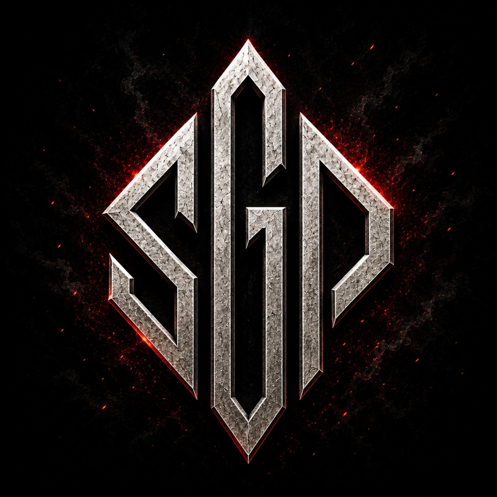

  

# STATIC GRAVE PRODUCTIONS

### MADE TO ENDURE.

Static Grave Productions is an independent game studio built around a simple belief:

**Imagination deserves the effort required to turn it into something worth experiencing.**

We create worlds and experiences with an emphasis on creativity, craft, integrity, and respect for the player. We aren't interested in chasing a formula simply because it's popular. If an idea is worth pursuing, we want to follow it where it deserves to go and give it the care necessary to become what it should be.

> **The Player Is Worth the Effort.**

---

## Our Projects

### SARVEL

An alien-world survival experience currently in development.

**Status:** In Development

More will be revealed when it's ready.

---

## Development

Static Grave Productions builds games and the technology needed to support them.

Current development work includes:

- Game development
- Gameplay systems
- Tools and supporting software
- Technical experimentation
- Research and prototyping

Public repositories will appear here as projects reach a stage where releasing them makes sense.

---

## Philosophy

We value:

- **Imagination**
- **Craft**
- **Integrity**
- **Independence**
- **Player respect**
- **Long-term thinking**

We would rather build deliberately than release something simply because we can.

---

**STATIC GRAVE PRODUCTIONS**

**MADE TO ENDURE.**

<!--
**Static-Grave-Productions/Static-Grave-Productions** is a ✨ _special_ ✨ repository because its `README.md` (this file) appears on your GitHub profile.

Here are some ideas to get you started:

- 🔭 I’m currently working on ...
- 🌱 I’m currently learning ...
- 👯 I’m looking to collaborate on ...
- 🤔 I’m looking for help with ...
- 💬 Ask me about ...
- 📫 How to reach me: ...
- 😄 Pronouns: ...
- ⚡ Fun fact: ...
-->
